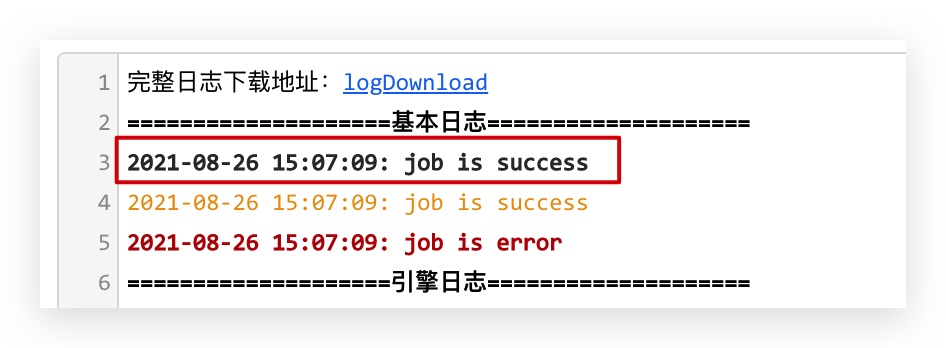
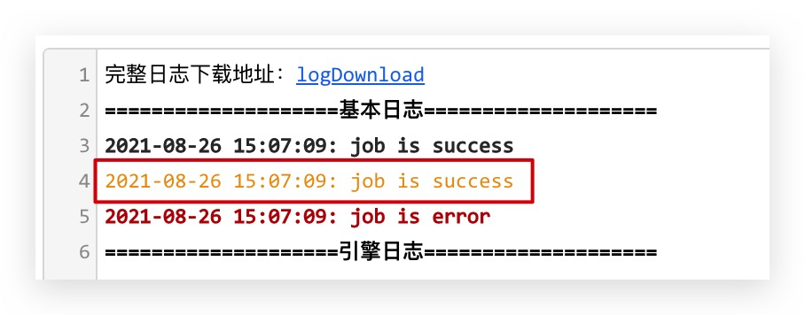
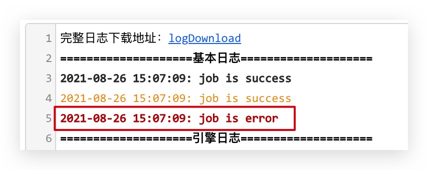
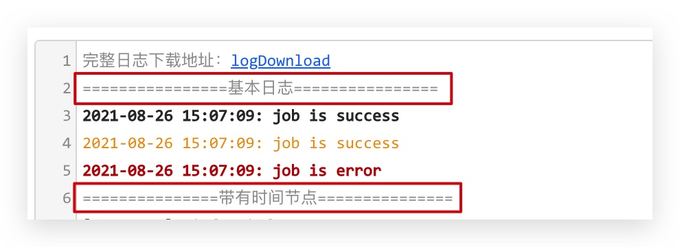

### 日志模式

根据业务衍生的日志模式，分为普通日志模式和自定义日志模式，如下：

#### 简单日志模式（mode: "log"）
- 默认情况下，首字母大写的单词会显示为红色

<component v-if="log" :is="log"></component>
```vue log-mode-demo
<template>
  <Codemirror 
    v-model:value="code" 
    :options="cmOptions" 
    border 
    :height="400" 
  />
</template>

<script setup>
import Codemirror, { createLinkMark, createLogMark, createTitle } from "codemirror-editor-vue3";
import { ref } from "vue"

const code = ref(`完整日志下载地址：${createLinkMark({ href: "/logDownload", download: "", target: "_blank" })}
${createTitle("基本日志")}
${createLogMark("2021-08-26 15:07:09: job is success", "info")}
${createLogMark("2021-08-26 15:07:09: job is success", "warning")}
${createLogMark("2021-08-26 15:07:09: job is error", "error")}
${createTitle("带有时间节点")}
${createLinkMark({ href: "/logDownload", download: "", target: "_blank" })}

====================引擎日志==================== 

DataStreamMain start
java.lang.NullPointerException
at
at java.util.Properties.load0(Properties.java:353)
at java.util.Properties.load(Properties.java:341)
at com.zhiweicloud.dataprocess.util.common.PropertiesUtil.getStringByKey(PropertiesUtil.
at com.zhiweicloud.dataprocess.engine.FlinkEngine.readFlinkEngineConfig(FlinkEngine.
at com.zhiweicloud.dataprocess.engine.FlinkEngine.buildFlinkStream(FlinkEngine.
at com.zhiweicloud.dataprocess.engine.FlinkEngine.startFlinkEngine(FlinkEngine.
at com.zhiweicloud.dataprocess.DataStreamMain.main(DataStreamMain.
 `)
const cmOptions = {
  mode: 'log',
  theme: 'default'
}
</script>
```


#### 自定义日志模式（mode: "fclog"）
<component v-if="fcLog" :is="fcLog"></component>
```vue fclog-mode-demo
<template>
  <Codemirror 
    v-model:value="code" 
    :options="cmOptions" 
    border 
    :height="400" 
  />
</template>

<script setup>
import Codemirror, { createLinkMark, createLogMark, createLog, createTitle } from "codemirror-editor-vue3";
import { ref } from "vue"

const code = ref(`完整日志下载地址：${createLinkMark({ href: "/logDownload", download: "", target: "_blank" })}
${createTitle("基本日志")}
${createLogMark("2021-08-26 15:07:09: job is success", "info")}
${createLogMark("2021-08-26 15:07:09: job is success", "warning")}
${createLogMark("2021-08-26 15:07:09: job is error", "error")}
${createTitle("带有时间节点")}
${createLog("info", "info")}
${createLog("warning", "warning")}
${createLog("error", "error")}
${createLinkMark({ href: "/logDownload", download: "", target: "_blank" })}

${createTitle("引擎日志")}

DataStreamMain start
java.lang.NullPointerException
at
at java.util.Properties.load0(Properties.java:353)
at java.util.Properties.load(Properties.java:341)
at com.zhiweicloud.dataprocess.util.common.PropertiesUtil.getStringByKey(PropertiesUtil.
at com.zhiweicloud.dataprocess.engine.FlinkEngine.readFlinkEngineConfig(FlinkEngine.
at com.zhiweicloud.dataprocess.engine.FlinkEngine.buildFlinkStream(FlinkEngine.
at com.zhiweicloud.dataprocess.engine.FlinkEngine.startFlinkEngine(FlinkEngine.
at com.zhiweicloud.dataprocess.DataStreamMain.main(DataStreamMain.
 `)
const cmOptions = {
  mode: 'fclog',
  theme: 'default'
}
</script>

```


<script >
export default {
  data() {
    return {
      log: null,
      fcLog:null
    }
  },

  mounted() {
    import('../views/demo/log/index.vue').then((module) => {
        console.log(module)

      this.log = module.default
        console.log(this.log)

    })
    import('../views/demo/log/fclog.vue').then((module) => {
        console.log(module)
      this.fcLog = module.default
        console.log(this.fcLog)
      
    })
  }
}
</script>

---

### 日志模式方法说明（public）
::: tip
以下方法为 `log` 模式和 `fclog` 模式共享方法
:::
| 名称   | 说明  | 参数  | 案例  | 
| ------ |:------------------:| :--------|:------:|
| `createLinkMark`  | 创建一个可点击的连接（a 标签），如下载完整日志 | 支持所有 a 标签属性，如：`{ href: "/target-link", download: "", target: "_blank" }` |  |
| `createLogMark`  | 标记日志的输出类型 | (text: string, **`'info'`**) => void|  |
|   |  | (text: string, type: **`'warning'`**) => void|  |
|   |  | (text: string, type: **`'error'`**) => void|  |
| `getLogMark`  | 获取当前标记的文本，返回节点数组 | `(value: string) => [{start: number, end: number ,node: HTMLElement}]`| - |
| `createTitle`  | 创建标题 | `(value: string) =>  void`|  |


### 自定义日志模式方法说明（mode: "fclog"）
::: tip
以下方法仅为 `fclog` 模式方法
:::


| 名称   | 说明  | 参数  | 案例  | 
| ------ |:------------------:| :--------|:------:|
| `createLog`  | 创建带有时间以及类型的日志文本 | (log: string, type: **`'info'`**) => string|  |
|   |  | (text: string, type: **`'warning'`**) => string|  |
|   |  | (text: string, type: **`'error'`**) => string|  |
